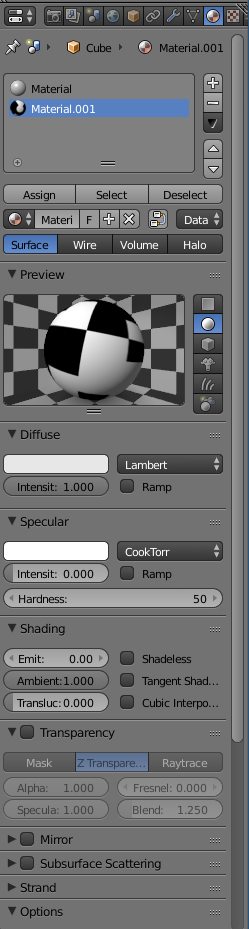

# How to make a tag model in blender

You first need to have a tag image file that you can wrap unto an
object using blender. For the life of it I couldn't get blender to
render the apriltag low-res png files without interpolation, so
first convert the image to higher resolution:

    convert -scale 1024.0 apriltag/apriltag_image/tag36h11/tag36_11_00000.png 000.png

Then start blender. You should see a cube. See the little tiny "Object
Mode" thingy in the corner? Switch that to "Edit Mode".

Now that you are in "Edit Mode", mouse hover over the cube and hit
"Ctrl-Tab". You'll get a pop-up. Select "Face". Now you are in face
selection mode. Right-click on the face you want: the top one.
Things should look like this now:

Now on the right side of your screen you see another ridiculous pile
of tiny icons, spin boxes etc:

Find the little icon that looks like hub or something, it's the second
from the right, and click on it:

Now click on the "+" to add a new material:

Now click on the "+ New at the bottom to get this":

Find the little icon one that looks like red/white checker board (Texture), and
click on it. You should get this:

Click on "+ New", and you'll get this:

About half way down the window you can see "Image->Open". Select the
png file you want to wrap (in this case "000.png"). Check that the
mapping says "UV". The rest you can all leave on defaults.

Things should now look like this:

Click on the round "Materials" hub-like icon again, and set "Shading"
to "Shadeless", "Specular Intensity" to 0, "Diffuse Intensity" to
1.0. Should look like so:

Hopefully, the face is still selected, because now it's time to hit
"Assign" in that window.

Now you go over the cube again, and hit "U". That should pop up a
menu. Select "Unwrap".

Now it's time to go into the UV editor. That thing is not easy to
find. You actually have to realize that at the very *bottom left* of every
pane, there is a tiny little selector. Click on the selector of the
useless pane underneath the pane that holds the cube, and select "UV
Editor". Things should now look like this:

Then there is another little spin box, next to the words "UVs". Click
on the arrows and select your image ("000.png"). Should now look like
this:

Now in the main window, select the "Render" display mode, it's the second
box on the bottom here:

Now it's only about scaling the object to the size we want (1m x 1m x
0.005m). For that, switch into "Alt Text" in the main window
(again, the little selector at the very bottom left of the window),
and switch back to maybe "Wire Frame" mode for the display while you
are at it. Things should look like this now:

Now press "N" over the cube. This will get you a Transform window,
where you can set the Dimensions to 1.25 x 1.25 x 0.005:

But that messed up the "Scale", which is now all over the place. You
must reset it or else. To do so, mouse over the cube while still in
Alt Text, and hit Ctrl-A. This will pop up a menu. Select "Scale"
there, and nothing should happen except that now the  Scale values
read "1.0". Switch back to "Render" mode one more time maybe to have a
look at the finished product:

Good enough. At the top left there is "File". Use that to first save
the file as blender file, then export as collada dae file. Done.

